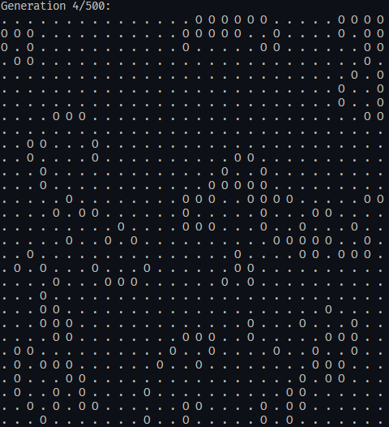
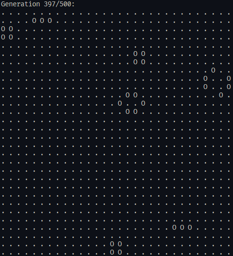

# Game of Life
This is a hobby project to implement Conway's Game of Life in Rust. The implementation was done completely from scratch, without using AI. The game itself runs in the terminal.

The goal of this project is to learn Rust and to have fun. :)

# Screenshots




# Commands

## Building
```bash
cargo build
```

## Running
```bash
cargo run
```

## Linting
```bash
cargo clippy
```

## Formatting
```bash
cargo fmt
```

## Tests
```bash
cargo test
```